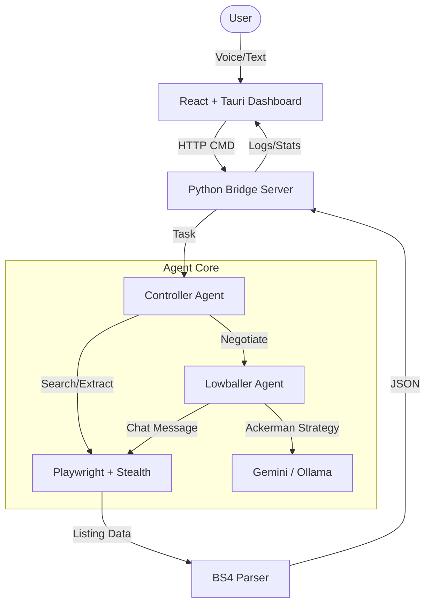

# 💰 Cheapskate.ai

### *The Ultimate AI-Powered Carousell Lowballer*

[](https://www.python.org/)
[](https://react.dev/)
[](https://tauri.app/)
[](https://playwright.dev/)
[](https://deepmind.google/technologies/gemini/)

**Cheapskate.ai** is an autonomous AI agent designed to find, analyze, and negotiate deals on Carousell Singapore. Using advanced negotiation tactics and modern web automation, it handles the "dirty work" of lowballing so you don't have to.

🚀 **[View on Devpost](https://devpost.com/software/cheapskate-ai)**

---

## ✨ Key Features

- 🕵️ **Autonomous Browsing**: Powered by Playwright with stealth capabilities, the agent navigates Carousell just like a human.
- 📉 **Strategic Negotiation**: Implements the **Ackerman Model** and **Chris Voss's "Never Split the Difference"** tactics.
- 🎙️ **Voice Commands**: Integrated speech-to-text allowing you to command your agent using your voice.
- 📊 **Unified Dashboard**: A sleek desktop app built with **Tauri v2** and **React 19** to monitor all your active negotiations.
- 🧠 **Multi-LLM Support**: Supports **Google Gemini 2.0**, **Ollama (Local)**, and more via LiteLLM.
- 🎭 **Persona-Based Chat**: Choose between "Student", "Urgent Cash", or "Chris Voss" personalities to suit your buying style.

---

## 🛠 Tech Stack

### **The Brain (AI & Logic)**
- **Python 3.10+**: Core backend logic and agent orchestration.
- **LiteLLM**: Unified interface for various LLMs (Gemini, Ollama, GPT-4).
- **Gemini 2.0 Flash**: High-speed reasoning and audio transcription.
- **Pydantic V2**: Robust data modeling and validation.

### **The Body (Web & Interaction)**
- **Playwright**: Modern web automation and browser management.
- **Playwright-Stealth**: Bypassing bot detection for seamless browsing.
- **BeautifulSoup4**: Precision DOM parsing and listing extraction.
- **Google Generative AI**: Native audio processing for voice commands.

### **The Interface (Dashboard)**
- **React 19**: Cutting-edge frontend framework for the control center.
- **Vite**: Ultra-fast build tool and dev server.
- **Tauri v2 (Rust)**: High-performance, secure native desktop wrapper.
- **Bridge Server**: A custom asynchronous HTTP bridge connecting the Python backend to the Tauri UI.

### **Negotiation Strategy**
- **Ackerman Model**: A systematic price escalation strategy (65% → 85% → 95% → 100%).
- **Tactical Empathy**: Using "Labels" and "Calibrated Questions" to build rapport with sellers.

---

## 🏗 System Architecture



---

## 🚀 Getting Started

### 1. Prerequisites
- **Python 3.10+**
- **Node.js & npm**
- **Ollama** (optional, for local LLM)

### 2. Installation
```bash
# Clone the repository
git clone https://github.com/WolfverusWasTaken/cheapskate.ai.git
cd cheapskate.ai

# Install Python dependencies
pip install -r requirements.txt

# Install Playwright browser
playwright install chromium

# Setup Dashboard
cd dashboard
npm install
```

### 3. Configuration
Copy `.env.example` to `.env` and fill in your API keys:
```env
LLM_PROVIDER=gemini
GEMINI_API_KEY=your_key_here
```

### 4. Run the Application
You can run the full integrated system using the provided batch file:
```bash
# Start backend, bridge and dashboard simultaneously
./start.bat
```

---

## 👤 The Vision
Cheapskate.ai was built during a crunch hackathon session to demonstrate how agentic workflows can solve real-world "annoyances"—like haggling for hours over S$10. It showcases the power of combining modern web automation with high-level psychological negotiation models.

---

## 📝 License
MIT License. Use responsibly and respect the Terms of Service of the platforms you interact with.

---
*Built with ❤️ by the Cheapskate.ai Team.*
